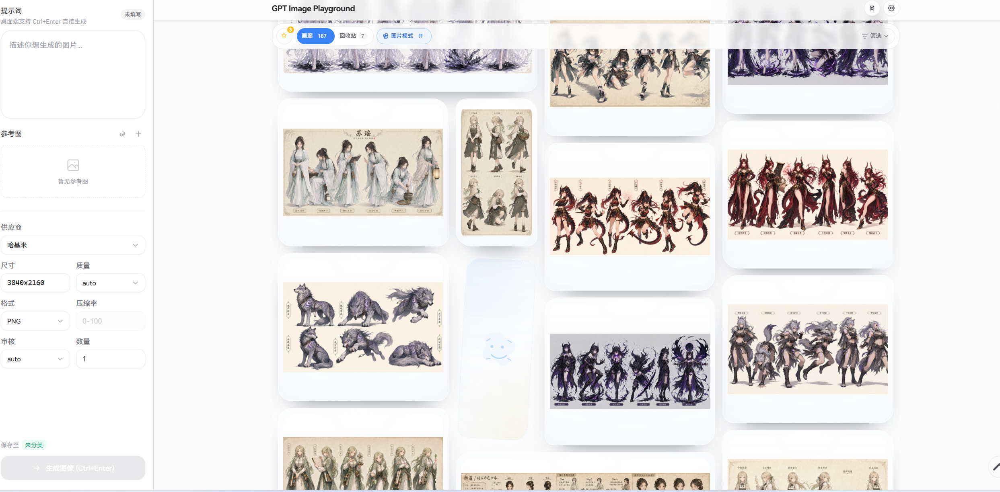
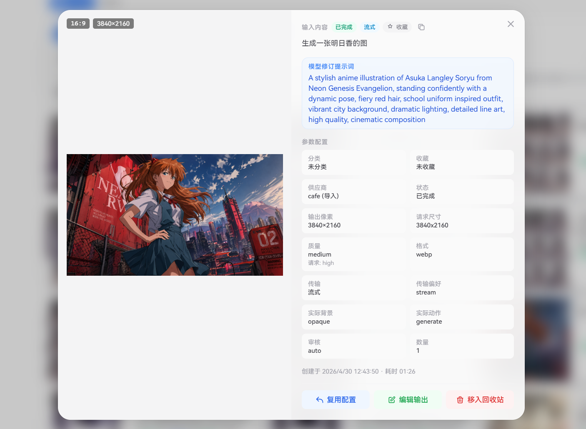

# GPT Image Playground

> **本地便携版说明**
>
> 本仓库为 `insistanan/GPT_Image_Playground` 的改造：
> - **已去除图片分享广场**：不再有“广场”页面与广场入口。
> - **已去除分享功能**：移除任务/提示词分享到广场的所有入口。
> - **图片本地缓存**：图片与任务数据通过 IndexedDB 存储在浏览器本地，天然满足本地缓存需求。
> - **设置密码加密保护**：生图 API 上游接口（baseUrl / apiKey / model 等）在界面配置，并用**访问密码**通过 `PBKDF2 + AES-GCM` 加密后保存在浏览器本地；每次打开应用需输入密码解锁才能使用，`apiKey` 不在磁盘落明文，也不会写进源码/公开仓库。
> - **可静态部署**：`npm run build` 产出的 `dist/` 为纯静态站点（相对路径），可直接部署到 Cloudflare Pages / GitHub Pages / Vercel 等静态托管。
> - **云端便携版**：部署到 Cloudflare Pages 时可把 **API 地址 / Key / 模型 / 网页登录密码**统一配置在环境变量里（见 §1.1），任何设备打开网页输入同一个登录密码即可使用，无需每台单独配置。

一个面向 OpenAI / GPT Image 工作流的本地优先图片生成与编辑工作台。  
它提供纯前端 Web UI，支持文本生图、参考图编辑、局部编辑、任务画廊、多供应商配置、Responses / Images 双协议兼容、流式优先传输、生成中增量保留已出图，以及本地数据导入导出。

这个项目现在更像一个“图片生成工作台”，而不是一次性出图的小面板：它会记录每次请求的参数、供应商、传输方式、输出图、失败上下文和来源链路，让图片从生成、筛选、复用、编辑到归档都有明确位置。

它仍然保持纯前端和本地优先：默认数据只存在浏览器里，适合个人工作流、私有 API 节点和高频试验。

项目重点放在实际创作流程里的细节：多供应商切换、Images / Responses 双协议兼容、流式优先与自动降级、尺寸合法范围规整、参考图输入策略、局部编辑蒙版、任务分类/收藏/回收站、多选与右键菜单、任务链追踪、ZIP 导入导出，以及密码加密的本地配置保护。

## 界面预览

<details>
  <summary>查看主界面截图</summary>
  <div align="center">
    <br>
    
  </div>
</details>

<details>
  <summary>查看任务详情截图</summary>
  <div align="center">
    <br>
    
  </div>
</details>


## 为什么是它

- 本地优先：任务记录、图片、配置都保存在浏览器本地，适合个人工作流、私有 API 节点和高频试验。
- 工作流完整：不是单纯的生图面板，而是围绕“生成 -> 筛选 -> 复用 -> 再编辑 -> 归档”设计。
- 协议兼容强：同时支持 `Images API` 与 `Responses API`，既能走生图，也能走编辑图，适合官方接口与各类兼容中转站。
- 可持续迭代：尺寸规整、任务分类、收藏、回收站、导入导出、右键菜单、局部编辑等能力已经形成较完整的产品骨架。

## 特性总览

- 文本生图、参考图编辑、局部编辑蒙版。
- 多供应商配置，按任务记录供应商快照。
- `Images API / Responses API` 双协议路由方式，支持通过 `Responses API` 发起生图与编辑图。
- `stream / json / auto` 传输模式与 `file_id / auto` 参考图输入模式。
- `Images API` 与 `Responses API` 都可按设置优先尝试流式；不兼容时会自动回退，并记录实际传输方式。
- 失败任务可原任务重试；运行中任务可确认中止；多图任务会边出边存，后续失败也尽量保留已生成结果。
- 标准任务卡片模式与纯图拼贴模式并存，支持拖图/粘图直接生成单图任务。
- 分类、收藏、回收站、搜索、状态筛选、多选、框选、批量操作。
- 尺寸选择器、比例预设、自定义宽高、合法尺寸自动规整。
- 图片右键菜单、任务右键菜单、大图查看、快速复用历史配置、多输出编辑翻页、来源任务链查看。
- IndexedDB 本地持久化、SHA-256 去重、ZIP 导入导出。
- 完整报错会随任务一起保存在浏览器本地，并在 15 天后自动清理。
- 本地代理模式下，开发服务器仍会额外把成功和失败请求写入 `logs/` 目录，便于本机排查。
- 内置 `vitest` 测试脚本，覆盖请求规划、SSE 读取与 payload 归一化等协议层逻辑。
- PWA 基础支持，可离线缓存应用壳资源。

## 架构一览

```text
React UI
  ├─ features/                    输入区、画廊、查看器、设置等按功能拆分的 UI 模块
  │  ├─ input/components/
  │  │  ├─ input-bar/            输入面板按提示词 / 参考图 / 参数 / 本地状态 hook 拆分
  │  │  ├─ prompt-library-drawer/ 提示词库按头部 / 保存表单 / 列表拆分
  │  │  ├─ search-bar/           画廊筛选栏按摘要、分类轨道、筛选区、状态 hook / 循环滚动 hook 拆分
  │  │  └─ size-picker/          尺寸选择器按模式面板 / 标签区 / 共享常量拆分
  │  ├─ settings/components/
  │  │  └─ settings-modal/       设置抽屉按供应商 / 凭据 / 请求策略 / 数据管理拆分
  │  ├─ gallery/components/
  │  │  ├─ task-grid/            网格容器按框选 hook、工具条、网格体、纯图拼贴模式拆分
  │  │  ├─ task-card/            卡片按预览区、元信息、操作区、状态 hook 拆分
  │  │  └─ ...                   右键菜单、移动分类弹窗等独立组件
  │  └─ viewer/components/
  │     ├─ detail-modal/         详情弹窗按预览区、信息区、图片状态 hook 拆分
  │     ├─ image-edit-modal/     局部编辑弹窗按画布区、侧栏、选区 hook、状态 hook 拆分
  │     ├─ lightbox/             大图查看按状态导航、缩放手势、视图壳层拆分
  │     └─ ...                   大图查看、局部编辑等查看器模块
  ├─ shared/components/          通用弹窗、Toast、Select 等共享组件
  ├─ store/                      状态管理、任务编排、分类/收藏/回收站、导入导出
  │  ├─ slices/                  provider / inputDraft / task / viewer / dialog 基础切片
  │  └─ taskRunner / gallery     任务运行时与画廊领域动作继续拆分
  ├─ lib/api/                    Images API / Responses API / SSE 解析 / 请求规划 / 响应归一化
  │  └─ __tests__/               协议层单测
  ├─ lib/db/                     IndexedDB schema / task / image 读写与迁移
  ├─ IndexedDB + 内存缓存        图片、任务、完整错误日志持久化、去重、按需读取
  ├─ Dev Proxy Logger            本地代理请求转发与开发机 success/error 日志落盘
  └─ PWA Shell                   manifest + service worker
```

核心数据流：

```text
用户输入
  -> store.ts 组装任务
  -> lib/api.ts 按协议发送请求
  -> lib/db/index.ts 与 imageAssets 写入 IndexedDB / 内存缓存
  -> TaskGrid / DetailModal / Lightbox 展示
```

## 关键设计点

- 本地优先存储
  使用 IndexedDB 保存任务与图片，避免依赖后端数据库；同时通过内存缓存减少重复读取。

- 本地错误快照
  每次请求失败时，会把完整错误上下文随任务一起保存到浏览器本地，便于“复制完整报错”直接拿到该次请求的完整排查信息；完整错误日志默认保留 15 天，过期后自动清理。

- 协议适配层
  `src/lib/api.ts` 是统一入口，具体实现拆分在 `src/lib/api/` 下，负责封装 `images/generations`、`images/edits`、`responses` 三类请求，并处理请求规划、自动回退、SSE 解析、响应归一化、图片内联压缩、文件上传等差异；相关回归测试放在 `src/lib/api/__tests__/`。

- 状态切片与领域模块
  `src/store/state.ts` 只做 store 装配，基础状态拆到 `src/store/slices/*`，任务运行时、画廊动作、图片资产、回收站清理等继续保持独立模块，避免再回到单文件大 store。

- DB 分层
  IndexedDB 访问已拆到 `src/lib/db/schema.ts`、`src/lib/db/tasks.ts`、`src/lib/db/images.ts`，分别处理 schema、任务记录和图片记录/迁移逻辑，避免协议层和 UI 直接接触底层存储细节。

- 组件分层细化
  当单个功能模块继续膨胀时，会在 feature 内部继续下钻子目录，例如 `input-bar/`、`prompt-library-drawer/`、`search-bar/`、`size-picker/`、`task-grid/`、`task-card/`、`settings-modal/`、`detail-modal/`、`image-edit-modal/`、`lightbox/`，把容器、分区组件、交互 hook、选项常量和交互壳层拆开，而不是继续把实现堆回单个入口文件。

- 长请求传输策略
  设置中的传输偏好会同时影响 `Images API` 与 `Responses API`。兼容时优先走流式；不兼容时自动回退到普通 JSON，并把任务最终实际走的是 `流式 / JSON / JSON（降级）` 记录到任务元信息与界面状态里。

- 增量结果保留
  多图任务在生成过程中会逐张落库并即时展示；即使后续图片失败、上游中断或用户手动中止，前面已经生成成功的图片仍会保留并可继续查看、复用或编辑。

- 任务快照机制
  每条任务会记录提示词、参数、供应商、分类等快照，保证历史可追溯，也便于“一键复用”。

- 图像引用与清理
  图片通过哈希去重，任务删除后会检查是否还有其它引用，避免误删仍在使用的资源。

- 尺寸合法性规整
  自定义尺寸会自动规整到模型更容易接受的范围，包括 16 倍数、最长边限制、长宽比限制和像素区间规整。

- 局部编辑工作流
  编辑输出并不是简单把结果图塞回参考图，而是建立“源图 + 蒙版 + 选区 + 编辑提示词 + 供应商”的完整编辑链路。

## 主要功能

### 1. 图片生成与编辑

- 文本生图。
- 参考图编辑，支持最多 16 张输入图。
- 支持通过 `Responses API` 执行文本生图、参考图编辑与局部蒙版编辑。
- 流式优先开启后，`Images API` 会优先附带 `stream: true` 与 `partial_images: 1`，`Responses API` 会优先走 SSE。
- 局部编辑弹窗，支持矩形选区、继续调整选区、清除蒙版、再次提交编辑；当任务有多张输出图时，可在弹窗内左右循环切换后再选择要编辑的那一张。
- 失败任务可在原任务上直接重试，不会新增重复记录；生成中任务支持确认后中止。
- 支持把历史输出作为下一轮输入，形成连续迭代。

### 2. 任务画廊与组织能力

- 瀑布流任务卡片。
- 纯图拼贴模式与单图任务导入。
- 分类、收藏、未分类、回收站视图。
- 关键词搜索、状态筛选，以及实际传输方式状态标识（`流式 / JSON / JSON（降级）`）。
- 多选、框选、批量收藏、批量移动分类、批量移入回收站/恢复。
- 回收站支持单条或批量彻底删除，并会自动清理 15 天前的记录。
- 任务右键菜单与图片右键菜单。

### 3. 参数与供应商配置

- 多供应商管理。
- 质量、格式、压缩率、审核强度、数量等参数可视化调整。
- 智能尺寸选择器：支持 `auto`、比例预设、自定义分辨率。
- 可设置传输偏好、`Responses` 参考图输入模式与提示词改写策略。
- 请求超时时间可配置，默认值为 900 秒。
- 编辑输出时也可单独选择供应商。

### 4. 本地数据与迁移

- 本地持久化任务与图片。
- 本地持久化完整错误日志，默认保留 15 天。
- 导出 ZIP，包含 `manifest.json`、设置、供应商、分类、任务记录与图片文件。
- 从 ZIP 导入完整历史数据。
- 自动清理孤立图片、过期回收站数据和过期完整错误日志。

### 5. 部署与运行环境适配

- 本地开发模式支持可选同源代理，缓解 CORS 问题。
- 浏览器侧的“复制完整报错”依赖本地 IndexedDB 中的任务错误快照，不依赖 dev server 文件日志。
- 本地代理模式会把成功与失败请求分别记录到开发机的 `logs/proxy-success.jsonl` 与 `logs/proxy-error.jsonl`。
- 支持静态部署（Cloudflare Pages / GitHub Pages / Vercel 等）。
- 提供 `manifest.webmanifest` 与 `sw.js`，具备基础 PWA 能力。

## 技术栈

| 类别 | 技术 |
| --- | --- |
| 前端框架 | React 19 |
| 语言 | TypeScript |
| 构建工具 | Vite 6 |
| 样式方案 | Tailwind CSS 3 |
| 状态管理 | Zustand |
| 测试 | Vitest |
| 本地存储 | IndexedDB |
| 数据打包 | fflate |
| 运行方式 | 本地开发 / 静态构建 |

## 快速开始

> 生图 API 上游接口通过**界面设置**配置，并用**访问密码**加密保存（见下方“配置 API 上游”）。
> 首次打开请先点击右上角**设置**，按提示**设置访问密码**后再填写 API 信息。

### 0. 快速使用

本项目是**面向 Git 直部署**的云端便携版：把 API 地址、Key、模型、网页登录密码统一配置在
Cloudflare Pages 环境变量里，部署后任何设备打开网页输入同一个登录密码即可使用。

- 已**去掉广场与分享**功能，保留本地图片缓存（IndexedDB）与任务画廊。
- 已清理本地便携版 / Tauri 桌面壳 / Docker 等本地部署相关的文件，仓库保持纯前端 + Cloudflare Pages Function 的最小结构。

### 1. 配置 API 上游（必要，带密码加密）

生图 API 上游接口在**界面设置**中配置，并使用**访问密码**加密后保存在浏览器本地：

1. 打开应用，点击右上角**设置**图标。
2. 首次使用会先引导**设置访问密码**（至少 4 位）——该密码用于加密保存你的 API 配置。
3. 设置密码后，填写生图 API 上游的 `baseUrl`、`apiKey`、`model` 等字段并保存。
4. 保存后，`apiKey` 等敏感字段会被 `PBKDF2 + AES-GCM` 加密后落盘；**下次打开应用需输入密码解锁**才能使用。

> - 密码**不会**被存储，仅用于在本地派生加密密钥；即使导出浏览器数据，没有密码也解不开 `apiKey`。
> - 需要改密码：解锁后点设置里的**改密码**。
> - 想锁定当前会话：点设置里的**锁定**，即会清空内存中的 API Key。
> - 由于配置已改为界面+加密，不再依赖源码 `src/local-config.ts`；该文件仅保留非敏感的默认值（baseUrl / model 等），`apiKey` 默认恒为空。

#### 1.1 云端便携版（推荐：部署到 Cloudflare，任何设备同一个密码即可用）

如果你希望**把 API 地址、Key、模型、网页端登录密码统一配置在 Cloudflare 里**，
部署后任何设备打开网页输入同一个登录密码即可使用，无需在每台设备上单独配置，请用下面的方式。

**原理**：本项目内置了 Cloudflare Pages Function（`functions/_config.ts`），
它会读取 Cloudflare Pages 环境变量并在前端探测；检测到已配置时自动进入「云端便携版」模式，
由云端统一下发生图 API 配置，并校验统一的网页端登录密码。

**在 Cloudflare Pages → Settings → Environment variables 配置以下变量：**

| 环境变量 | 说明 | 示例 |
| --- | --- | --- |
| `API_BASE_URL` | 生图 API 上游接口地址 | `https://api.openai.com` |
| `API_MODEL` | Images API 模型 | `gpt-image-2` |
| `RESPONSES_IMAGE_MODEL` | Responses API 图片模型（可选，默认取 `API_MODEL`） | `gpt-image-2` |
| `API_KEY` | 上游接口的 API Key | `sk-xxxx` |
| `APP_PASSWORD` | 网页端登录密码 | `你的密码` |

**注意**：
- 若使用方式 A（直接拖拽 `dist/` 上传），`functions/` 不会被部署，无法启用云端便携版；
  请改用方式 B（连接 Git 仓库自动部署），让 Cloudflare 一并编译 `functions/`。
- `API_KEY` 与 `APP_PASSWORD` 只存在于服务端，不会写入前端产物；
  密码通过 `/_config/login` 在服务端校验，校验通过后才会向当前会话下发 `apiKey`。
- 启用云端便携版后，界面设置中的 API 配置区会自动隐藏（由云端统一管理），
  仅保留「锁定」与数据管理功能。

### 2. 本地开发（需命令）

```bash
npm install
npm run dev
```

如需执行协议层单测，可额外运行：

```bash
npm run test
```

启动后访问：

```text
http://localhost:5173
```

### 3. 本地代理开发

如果你的接口没有正确放开浏览器跨域，可以启用本地代理。

仓库中提供：

- `dev-proxy.config.example.json`
- `dev-proxy.config.json`

典型配置如下：

```json
{
  "enabled": true,
  "prefix": "/api-proxy",
  "target": "http://127.0.0.1:3000",
  "changeOrigin": true,
  "secure": false
}
```

当设置中的 `请求模式` 选择 `local_proxy` 时，前端会优先走 Vite 开发服务器同源代理。

启用后，Vite 开发服务器所在机器会把请求成功和失败日志分别追加写入：

- `logs/proxy-success.jsonl`
- `logs/proxy-error.jsonl`

同时，前端任务失败时会把该次请求的完整错误快照保存在浏览器本地 IndexedDB 中；“复制完整报错”优先使用这份本地日志，不依赖 `logs/` 目录。

### 4. 构建产物

```bash
npm run build
npm run preview
```

说明：

- `npm run build` 仅生成静态产物。
- `npm run preview` 下只能使用 `direct`；`local_proxy` 仍然只在 `npm run dev` 生效。

### 5. 部署

#### 5.1 Cloudflare Pages（推荐，免费）

本项目构建产物为**纯静态站点**（相对路径），可直接部署到 Cloudflare Pages：

**方式 A：直接拖拽 `dist/` 上传**

```bash
npm run build   # 生成 dist/
```

到 Cloudflare 控制台 → **Workers & Pages** → **Create** → **Pages** → **Upload assets**，把 `dist/` 文件夹整个拖进去即可发布。

**方式 B：连接 Git 仓库自动部署**

1. Cloudflare 控制台 → **Workers & Pages** → **Create** → **Pages** → **Connect to Git**，选择本仓库。
2. 构建配置：
   - **Build command**：`npm run build`
   - **Build output directory**：`dist`
3. 保存后 Cloudflare 会在每次推送时自动构建并发布。

> SPA 路由回退已通过 `public/_redirects`（内容：`/* /index.html 200`）自动带上，无需额外配置。

**注意事项**

- 静态托管环境只能使用 `direct` 请求模式，要求上游接口支持浏览器直连（`HTTPS`、`CORS`、预检）。
- 若采用方式 A（拖拽 `dist/`）部署，应用为**本地密码加密**模式：API Key 仅在解锁后存在于浏览器内存，并加密保存于浏览器本地（见“配置 API 上游”）；没有密码无法使用。
- 若希望**把 API 地址、Key、模型、网页登录密码统一配置在 Cloudflare**、任何设备输入同一个密码即可使用，请使用**方式 B**（连接 Git 仓库）部署，并配置环境变量（见上文 §1.1「云端便携版」）。只有方式 B 才会部署 `functions/` 下的 Pages Function，从而启用云端便携版。

#### 5.2 GitHub Pages

- 当前仓库保留了 GitHub Pages 自动部署工作流，配置见 `.github/workflows/deploy.yml`。
- 推送符合 `v*` 规则的标签后，会自动执行 `npm ci`、`npm run build` 并发布到 GitHub Pages。

#### 5.3 自托管（Docker / Nginx）

> 当前仓库已精简为**纯前端 + Cloudflare Pages Function** 的 Git 直部署形态，
> 不再内置本地部署用的 Docker / Nginx 文件。如需自托管，参考 `npm run build` 产出的静态 `dist/` 与任意 Web 服务器即可。

### 6. 广场 Worker 常用操作

> 广场 / 分享功能已按需求移除，相关 Worker（`workers/square-api`）已一并清理，不再提供广场后端部署操作。

## 项目结构

```text
.
├─ AGENTS.md
├─ CLAUDE.md
├─ CONTEXT.md                  领域语言与概念约束
├─ .github/workflows/
│  └─ deploy.yml               GitHub Pages 标签部署
├─ docs/
│  ├─ code-style.md            详细代码规范
│  └─ images/                  README 截图资源
├─ functions/
│  └─ _config.ts                Cloudflare Pages Function（云端便携版配置/登录）
├─ logs/
│  ├─ proxy-success.jsonl       本地开发代理成功请求日志
│  └─ proxy-error.jsonl         本地开发代理失败请求日志
├─ public/
│  ├─ manifest.webmanifest      PWA manifest
│  ├─ pwa-icon.svg              PWA 图标
│  └─ sw.js                     Service Worker
├─ src/
│  ├─ app/                      应用级骨架组件
│  ├─ features/                 按功能拆分的业务 UI 模块
│  │  ├─ gallery/components/
│  │  │  ├─ task-card/          任务卡片拆分后的真实实现
│  │  │  └─ task-grid/          任务网格与纯图拼贴模式
│  │  ├─ input/components/
│  │  │  ├─ input-bar/          输入面板拆分后的真实实现
│  │  │  ├─ prompt-library-drawer/ 提示词库拆分后的真实实现
│  │  │  ├─ search-bar/         搜索/分类栏拆分后的真实实现
│  │  │  └─ size-picker/        尺寸选择器拆分后的真实实现
│  │  ├─ settings/components/
│  │  │  └─ settings-modal/     设置抽屉按 API 分区 / 数据管理拆分后的真实实现
│  │  └─ viewer/components/
│  │     ├─ detail-modal/       详情弹窗拆分后的真实实现
│  │     ├─ image-edit-modal/   局部编辑弹窗拆分后的真实实现
│  │     └─ lightbox/           大图查看拆分后的真实实现
│  ├─ hooks/                    自定义 hooks
│  ├─ lib/
│  │  ├─ api/                   协议适配、请求规划、SSE 解析、归一化
│  │  │  └─ __tests__/          协议层单测
│  │  ├─ db/                    schema / tasks / images
│  │  ├─ devProxy.ts            本地代理辅助
│  │  └─ size.ts                尺寸处理
│  ├─ shared/                   共享组件
│  ├─ store/
│  │  ├─ slices/                provider / inputDraft / task / viewer / dialog
│  │  └─ ...                    gallery、taskRunner、imageAssets 等领域模块
│  ├─ App.tsx                   应用骨架
│  ├─ main.tsx                  入口与 Service Worker 注册
│  ├─ store.ts                  Store 统一导出入口
│  └─ types.ts                  类型定义
├─ dev-proxy.config.example.json
├─ dev-proxy.config.json
├─ vite.config.ts
├─ package.json
└─ README.md
```

## FAQ

### 数据存在哪里？

默认存储在浏览器本地 IndexedDB。
清缓存、换浏览器或换设备后，数据不会自动同步，建议定期导出 ZIP 备份。

其中包括：

- 任务记录
- 本地图片
- 失败任务的完整错误日志快照

完整错误日志默认保留 15 天，到期会自动清理；任务本身不会因此被删除。

### 为什么静态部署后可能不能正常请求 API？

静态部署环境不能使用 `local_proxy`，因为它依赖 Vite 开发服务器提供的同源代理。

因此在 `dist/` 静态托管、`vite preview`、GitHub Pages、Vercel 这类环境里，只有切到 `direct` 才可能工作；如果上游接口不支持浏览器直连（例如缺少 `CORS`、预检失败、`HTTPS` 页面请求 `HTTP` 接口），请求仍然会失败。

### `Images API` 和 `Responses API` 有什么区别？

- `Images API` 更直接，适合标准图片生成/编辑链路。
- `Responses API` 更灵活，适合统一接入、流式输出和更多兼容场景。
- 本项目里，`Responses API` 不只用于生图，也支持带参考图和蒙版的编辑图工作流。
- 本项目支持手动切换 `Images API` 与 `Responses API`，并在传输层按设置处理兼容性与降级。

### 为什么这里强调 SSE 流式传输？

部分图片任务耗时较长，直接等待完整 JSON 容易在兼容中转链路上超时。
本项目支持 `Responses API` 的 SSE 流式响应解析，也会在 `Images API` 上按设置优先尝试流式参数；在兼容服务支持的前提下，更适合处理长耗时生图与编辑请求。

### 为什么我设置了流式优先，任务里显示的却是 `JSON（降级）`？

这通常说明前端已经按“优先流式”发起请求，但当前供应商或当前协议组合并不完全兼容流式返回，于是自动回退到了普通 JSON。

这不是单纯的 UI 文案推测，而是按本次任务的实际请求结果记录的：

- `流式`：本次任务最终确实走了流式传输。
- `JSON`：本次任务直接走普通 JSON。
- `JSON（降级）`：本次任务先尝试过流式，随后因为兼容性问题回退到普通 JSON。

### 局部编辑的蒙版是怎么工作的？

局部编辑的本质是：

- 原图作为输入图。
- 选区被转换为同尺寸蒙版。
- 模型只在允许修改的区域内执行编辑。

如果你使用兼容中转站，且发现蒙版编辑结果异常，优先检查它是否完整支持 `images/edits` 或 `Responses API` 的掩码编辑能力。

### 导出 ZIP 里包含什么？

- `manifest.json`
- 设置、供应商与分类快照
- 任务记录
- 本地图片文件
- 远程图片 URL 元数据

任务记录里会保留提示词、参数、供应商快照、传输方式、错误快照、中止状态等任务元信息，适合迁移浏览器环境或做长期备份。

### 请求日志记录在哪里？

分两层：

- 浏览器本地日志
  失败任务的完整错误上下文会和任务一起保存在浏览器本地 IndexedDB 中，详情弹窗里的“复制完整报错”直接读取这里的数据。
  这部分日志默认保留 15 天，之后自动清理。

- 开发代理文件日志
  当你在本地开发环境启用 `local_proxy` 时，运行 Vite dev server 的那台机器还会额外写入：

- 成功请求会写入 `logs/proxy-success.jsonl`
- 失败请求会写入 `logs/proxy-error.jsonl`

`logs/` 里的文件日志记录的是代理层请求 URL、目标 URL、状态码、请求摘要、响应摘要和耗时，方便排查本机代理转发问题；它不是多用户隔离存储，也不是前端“复制完整报错”的唯一来源。

## 文档入口

- [README.md](./README.md)：项目总览、快速开始、FAQ。
- [AGENTS.md](./AGENTS.md)：项目级协作说明。
- [CLAUDE.md](./CLAUDE.md)：与 `AGENTS.md` 保持一致的项目级协作说明。
- [docs/code-style.md](./docs/code-style.md)：详细代码规范。
- [docs/images](./docs/images)：界面截图。
- [dev-proxy.config.example.json](./dev-proxy.config.example.json)：本地代理配置模板。
- [src/store.ts](./src/store.ts)：Store 统一导出入口；具体实现见 [src/store](./src/store)。
- [src/lib/api.ts](./src/lib/api.ts)：API 统一导出入口；具体实现见 [src/lib/api](./src/lib/api)。

## 贡献

欢迎继续迭代这个项目。

建议的贡献方式：

1. Fork 仓库并创建功能分支。
2. 保持单次提交聚焦单一目标。
3. 提交 PR 时说明改动背景、实现方式和影响范围。
4. UI 改动尽量附截图，接口兼容改动尽量附示例请求场景。
5. 不要提交本地缓存、临时日志、无关构建产物。

## 许可证

本项目使用 [MIT License](./LICENSE)。

## 致谢

- 上游项目：[CookSleep/gpt_image_playground](https://github.com/CookSleep/gpt_image_playground)
- 社区交流：[LINUX DO](https://linux.do)
